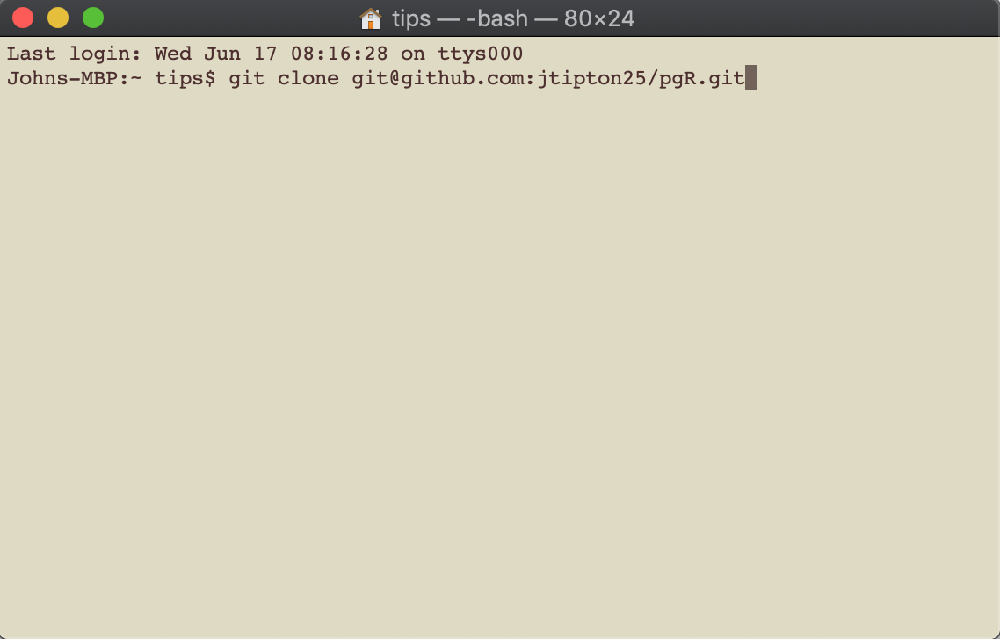
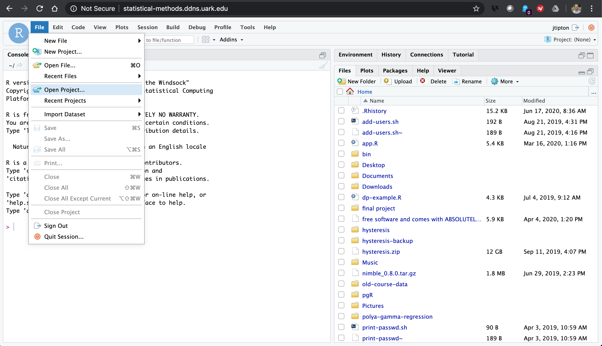

<!-- README.md is generated from README.Rmd. Please edit that file -->

```{r, include = FALSE}
knitr::opts_chunk$set(
  collapse = TRUE,
  comment = "#>",
  fig.path = "man/figures/README-",
  out.width = "100%"
)
```

# pgR

<!-- badges: start -->
[](https://github.com/jtipton25/pgR/actions)
[](https://codecov.io/gh/jtipton25/pgR?branch=master)
[](https://www.tidyverse.org/lifecycle/#maturing)
<!-- badges: end -->

## About the package

This package includes a parallel implementation to sample from Polya-gamma random variables as well as Markov Chain Monte Carlo (MCMC) code for fitting Bayesian multinomial regression models using MCMC. The classes of models currently available include multinomial regression using the `pg_lm()` function, multinomial spatial regression using the `pg_splm()` function, multinomial regression with spatially varying coefficients using the `pg_svlm()` function, and spatio-temporal using the `pg_stlm()` function.

## Package Installation
There are two options to install the package. You can install the package directly from gitHub or you can clone the package and install locally. The direct installation from gitHub is preferred if you are interested in only using the package and the installation from a cloned gitHub repo is preferred if you are interested in development of the package. 

If this is your first time installing this package, make sure you have setup your [gitHub personal access token following the instructions below](#setup-github-personal-access-token) and [make sure you have the appropriate compiler](#make-sure-you-have-the-appropriate-compiler).


### Direct installation from gitHub

Direct installation from gitHub is preferred if you are a use of this package. Once you have setup your [gitHub personal access token](#setup-github-personal-access-token) and [made sure you have the appropriate compiler](#make-sure-you-have-the-appropriate-compiler), you can install the `devtools` package using 

```r
install.packages("devtools")
```

Once the `devtools` library is installed, you can install the `pgR` library using

```r
devtools::install_github("jtipton25/pgR")
```
**Note: It is recommended to reguarly check for updates by using `devtools::install_github("jtipton25/pgR")` regularly as this package is in development and regularly undergoes large changes**

### Installation from a cloned repository

Installation from a cloned repository is preferred for those who are actively contributing to package development. To install from a cloned repository, first open the repository on gitHub at [https://github.com/jtipton25/pgR](https://github.com/jtipton25/pgR). Then click on the clone repository button

<p align="center">

</p>

and clone copy the output to the clipboard. Then open up a terminal window and type 

```
git clone git@github.com:jtipton25/pgR.git
```

<p align="center">

</p>


Once the gitHub repo has finished downloading, open the project in RStudio by finding and selecting the `pgR.Rproj` file 

<p align="center">



</p>


Once the project file has been opened, you can use the build tab to "Install and Restart" or "More -> Clean and Rebuild" to install the package. If you add or modify `R` code, you can reinstall the updated package using "Install and Restart". If you add or modify `c++` code using `Rcpp`, use the "More -> Clean and Rebuild" option in the build tab to recompile the `c++` code.

<p align="center">


</p>

or you can clone the project and install it locally using RStudio. 


### Setup gitHub Personal Access Token

For either installation method, you will need a personal access token (PAT) -- see [here](https://happygitwithr.com/github-pat.html) for how to set this up as this is what I based the following on. It's pretty simple, first, make sure the `usethis` library is installed using

```r
install.packages("usethis")
```
and then use 

```r
usethis::browse_github_pat()
``` 
to open a webpage using your gitHub account. On this webpage is a form to create your PAT with reasonable settings. Give the PAT a nickname and click "Generate token" and the token will be displayed. The token is a string of 40 random letters and digits. Make sure you **copy this token to your clipboard** as this is the last time you will be able to see it.

Once you have generated a gitHub PAT and copied it to your clipboard, we will add the PAT to your `.Renviron` file. The goal is to add the following line in your `.Renviron` file:

```r
GITHUB_PAT=XXXXX
```

where the XXXX is the PAT copied from github. The `.Renviron` file is a hidden file that lives in your home directory. If you are comfortable with the terminal, you can edit this by hand using your favorite text editor. If you are not comfortable with the terminal, the `.Renviron` file can be edited in `R` using the `usethis` package. In `R` type

```r
usethis::edit_r_environ()
```

Your .Renviron file should pop up in your editor. Add your GITHUB_PAT as above,

```r
GITHUB_PAT=XXXXX
```

with a line break at the end of the file save the `.Renviron` file and close it. If questioned, YES you do want to use a filename that begins with a dot `.`. Note that, by default, most dotfiles are hidden in the RStudio file browser, but `.Renviron` should always be visible.

Restart `R` (Session > Restart R in the RStudio menu bar), as environment variables are loaded from `.Renviron` only at the start of an `R` session. Check that the PAT is now available like so:

```r
usethis::git_sitrep()
```

You should see the following line in the output:

```
* Personal access token: '<found in env var>'
```

Now commands you run from the devtools package, which consults GITHUB_PAT by default, will be able to access private GitHub repositories to which you have access.

### Make sure you have the appropriate compiler

- **Linux**: It is assumed on Linux systems, the appropriate compiler is available

- **Windows**: For Windows, download and install RTools. For R (>=4.0.0) follow the instructions [here](https://cran.r-project.org/bin/windows/Rtools/) -- older versions of R follow the instructions [here](https://cran.r-project.org/bin/windows/Rtools/history.html).

- **MacOS**: If you are on a Mac, make sure you have an openMP supported compiler -- see [here](https://thecoatlessprofessor.com/programming/cpp/r-compiler-tools-for-rcpp-on-macos/) for instructions on how to get this setup. Follow the instructions for your specific version of R


